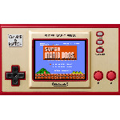

# Game & Watch: Super Mario Bros.

  
|Component|Description                                  |
|---------|---------------------------------------------|
|CPU      |STM32H7B0VBT6 ARM Cortex-M7 280MHz           |
|RAM      |1380KB                                       |
|Storage  |128KB + 1MB                                  |
|Screen   |2.4" 320x240                                 |
|Gamepad  |DPad, 2 Buttons, GAME, TIME, PAUSE/SET, Power|
|USB      |OTG                                          |
|Battery  |3.7V 525mA                                   |
|Dimension|112mm x 67mm x 12.5mm                        |
|Weight   |70g                                          |

### https://steward-fu.github.io/website/index.htm
